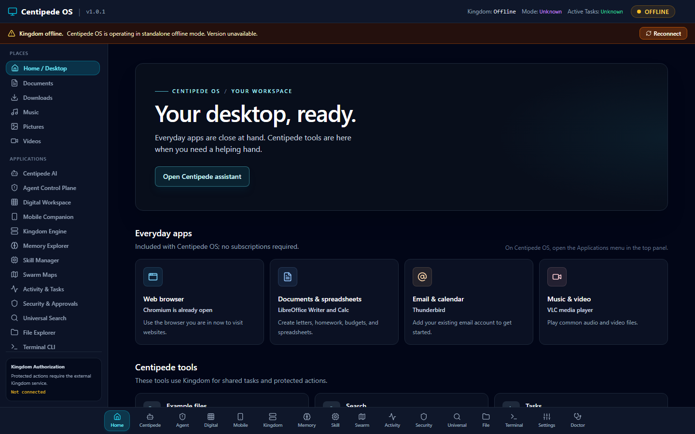

# Centipede OS

Centipede OS is a free desktop operating system with a custom Centipede-branded live workspace and the Centipede web app. Kingdom is a separate service; it is not included in the download.

## Download and try Centipede

**New to this?** Download the ISO, write it to an empty USB drive, and start the other computer from that USB. The live session does not install Centipede or replace Windows.

<p><a href="https://github.com/wests-cmd/Centipede-os/releases/download/v1.0.0/centipede-os-1.0.0-live-usb-x86_64.iso"><strong>⬇️ Download Centipede OS v1.0.0 for USB</strong></a></p>

This is the current public release. A newer image is still being checked and will appear here after the desktop boot and installer safety checks pass.

**Before you start:** The USB needs at least 8 GB free. Writing the image erases the USB. Files saved during a live session may be lost when you shut down. Keep the PC’s internal drive connected and do not choose an install or erase option.

### Make the USB (Windows, Mac, or Linux)

Use an empty USB drive with at least 8 GB free (16 GB is a comfortable choice). Copy anything you need from it first; writing the image erases the USB.

1. Click **Download Centipede OS v1.0.0 for USB** above and save the `.iso` file.
2. Download and open [balenaEtcher](https://etcher.balena.io/). It is a free USB writing app for operating system images.
3. In Etcher, click **Flash from file** and choose the Centipede `.iso` you downloaded.
4. Click **Select target**. Choose your USB drive by its name and size. Check carefully that it is the USB drive, not another drive.
5. Click **Flash!** and approve the erase warning. Wait for Etcher to say the flash is complete, then close it and safely eject the USB.

### Start Centipede from the USB

1. Save and close anything open on the other PC. Leave its internal drive connected; do not choose an install or erase option.
2. Shut the PC down. Insert the Centipede USB and turn the PC on.
3. Immediately tap the PC maker’s **boot menu** key. Common keys are `F12`, `F9`, `F11`, or `Esc`; the right key depends on the PC and may briefly appear on its startup screen.
4. Use the arrow keys to select the USB drive (often shown as `UEFI: <USB name>`) and press `Enter`.
5. Choose the default live/start option if a menu appears. Wait for the desktop to load.
6. To leave, shut down Centipede, remove the USB when the PC is off, and turn the PC on again. It should start its usual system.

If the PC does not show a boot menu, restart and try the other common key or look up “boot menu” plus the PC maker and model. Do not change Secure Boot or firmware settings as a first troubleshooting step.

> **Current release:** v1.0.0 starts a temporary live session. It does not install Centipede to the computer or save files after shutdown. A disk installer update is not available yet.

### Start Centipede over Ethernet

If the other PC supports network boot, you can start the live image over a direct Ethernet cable. Follow the [Ethernet network boot guide](docs/NETWORK_BOOT_GUIDE.md). Network boot starts a live session; it does not install Centipede to the computer. The current public v1.0.0 image has no disk installer.

### Centipede desktop preview



This is an app preview, not a screenshot of the current public live image.

## What is included

The public release includes the Centipede web app, a live USB image, and a Docker image. Kingdom remains a separate service. A new desktop image with free everyday apps is being validated and is not published yet. Android/iOS projects are prototypes; there is no signed phone release.

The interface is a client for Kingdom, a separately operated service. Centipede does not include Kingdom or gain control of the host PC. Some panels are prototypes or use local example data. The browser companion can enroll a phone against the running Centipede service: open Centipede on the host computer at `http://localhost:3000`, create a one-time code, then open the printed phone address on the same network and enter the code there. The API requires a loopback socket peer and a localhost request host for code creation and device administration; browser origin and Fetch Metadata checks further reject cross-origin requests. Request headers alone cannot grant local authority. Pairing uses plain HTTP, so keep it on a private, trusted network and never expose the port to the internet. Pairing records last only for the current server session. Docker or reverse-proxy setups are not certified for host device administration when their API sees a bridge/proxy peer instead of loopback. This is device enrollment only; the native Android/iOS apps and mobile task/approval workflows are not ready. The live image has limited hardware firmware and may not support every Wi-Fi or graphics device.

## Local models and richer tasks

The Kingdom page includes a local Ollama model manager. From the Centipede host, you can pull an Ollama model or create a reusable custom model with a system prompt. This is model configuration, not weight fine-tuning. The task composer accepts longer instructions and can extract text from PDFs, ZIPs, Word, spreadsheet, presentation, code, text, and image files. Optional image descriptions, task plans, and context summaries use the configured local model; review the result before submitting it to Kingdom. Files are bounded and treated as untrusted reference data. See the [local AI and task workspace notes](docs/LOCAL_AI_TASK_WORKSPACE.md) for size limits and what remains unsupported.


## App updates

When a newer browser app is served by the Centipede server, same-line patch updates automatically reload the page; minor or major version changes ask first. The browser fetches the served app assets again, so this is not a binary delta update and the page briefly restarts. This refresh updates the browser app only. There is no installed-system updater, in-place ISO/Docker/Kingdom update, or system rollback yet; those require a separate signed release/install process.
## Boot troubleshooting

The next image update is being checked in BIOS and UEFI virtual machines, including its Safe Graphics option. The current download remains the earlier v1.0.0 release. Physical graphics compatibility varies by computer.

The branded update replaces upstream artwork on user-facing boot and desktop screens while retaining required license notices and compatibility metadata. See [branding details](docs/BRANDING.md) and the [boot and recovery checklist](docs/BOOT_RECOVERY_CHECKLIST.md).
## Current release and target status

- The current stable release is [Centipede OS v1.0.0](https://github.com/wests-cmd/Centipede-os/releases/tag/v1.0.0).
- The next desktop/OS update is not published. The earlier build showed an upstream splash and generic live desktop, so it is being corrected before another preview is offered.
- The public v1.0.0 image is a live-only session. No disk installer is currently certified.
- Android device distribution is blocked until the protected signing key and publisher fingerprint are configured.
- iPhone distribution is blocked until Apple distribution signing and provisioning are configured. The iOS Simulator app is not installable on an iPhone.
- Docker contains the Centipede web app, not Kingdom. Running it requires Docker and does not provide the USB desktop experience.

See the [ship reality matrix](docs/SHIP_REALITY_MATRIX.md), [platform build guide](docs/PLATFORM_BUILD_GUIDE.md), and [release certification](docs/release/RELEASE_CERTIFICATION.md) for validation evidence and limits.

## Discord community

[Join the Centipede / Kingdom Discord](https://discord.gg/4b8f9YS2Wp) for community discussion and help. The invite currently points to **Kingdom's server**.

The server's **Kingdom Centipede Skill Bot** can show approved project notes:

- `/skillmap` lists approved Kingdom or Centipede skills.
- `/ask` looks up approved notes; choose a project and ask a specific question.
- `/aiask` drafts an answer with local AI and approved notes. Check AI drafts before relying on them.
- `/botstatus` checks the bot. Administrators can add approved notes with `/teach`.

The bot is for help and reference; it does not execute Kingdom tasks or grant permissions. Never share pairing codes, owner tokens, or API keys in Discord.

## Running the web app (developers)

Requires Bun and Node-compatible tooling:

```bash
git clone https://github.com/wests-cmd/Centipede-os.git
cd Centipede-os
bun install --frozen-lockfile
bun start
```

The app prints its local URL. It listens on the loopback address and the first private IPv4 interface it finds so a phone can reach it without opening every interface. The browser uses Centipede&apos;s same-origin Kingdom proxy so the Kingdom credential stays on the server. Read endpoints are allowlisted; task submission and cancellation are forwarded only from verified local-admin requests.

To connect Kingdom, configure `KINGDOM_API_URL` and `KINGDOM_API_TOKEN` in the Centipede server environment. A host process can use `http://127.0.0.1:8000`; a Centipede container can use `http://host.docker.internal:8000` when Kingdom is published on the host at port 8000. Use a least-privilege credential where Kingdom supports it, keep it out of source control, and never paste it into the browser URL field. The proxy exposes allowlisted status/catalog reads and local-admin task submission/cancellation. It does not proxy runtime controls, model provider secrets, or arbitrary Kingdom writes.

For phone pairing, keep the app running and open it on the host computer using `http://localhost:3000`. Create a pairing code there, then open the printed phone address on a phone connected to the same trusted network and enter the one-time six-digit code. If a firewall asks, allow Centipede only on your private network. Pairing uses plain HTTP. Docker users can set `CENTIPEDE_PUBLIC_URL` to the PC's LAN address (for example, `http://192.168.1.20:3000`) for the phone-facing address, but the current loopback-only admin gate means Docker bridge/reverse-proxy management may be unavailable; that setup is not certified yet.

## Developer checks

```bash
bun x tsc --noEmit
bun test
npm run build
npm run test:e2e
```

The release workflow also builds ISO/USB/VM and Docker targets, generates a release manifest and SHA-256 checksums, and fails on missing or mismatched build outputs. Mobile release builds remain blocked until signing is configured.

## Kingdom compatibility

- Protocol major: `1`
- Minimum contract version: `1.4.0`
- Kingdom remains the execution authority. These compatibility identifiers are independent of Centipede's product version.
